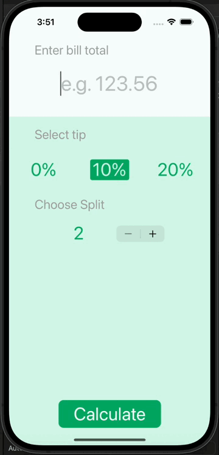

# Tipsy

## Goal

Tipsy is a handy utility application built using Swift, designed to facilitate the splitting of bills among a group of people while also factoring in the tip percentage. The app follows the Model-View-Controller (MVC) architectural pattern for a structured and maintainable codebase. Additionally, Tipsy employs a navigation controller to present detailed results modally on a separate page. Key features of the app include:

## Bill Splitting Functionality 
Tipsy enables users to input the total bill amount and the number of people sharing the bill. Using this information, the app calculates the amount each person needs to pay, including the tip.

## Tip Percentage Input 
Users can specify the tip percentage they wish to apply to the total bill. Tipsy then computes the tip amount and distributes it among the individuals accordingly.

## Model-View-Controller Architecture
The app architecture follows the MVC pattern, separating the application's logic into three distinct components: Model (data and business logic), View (user interface), and Controller (mediator between Model and View).

## Navigation Controller
Tipsy utilizes a navigation controller to manage the navigation flow within the app. When users initiate the bill splitting process, the navigation controller presents a new view modally, displaying detailed results on a separate page.